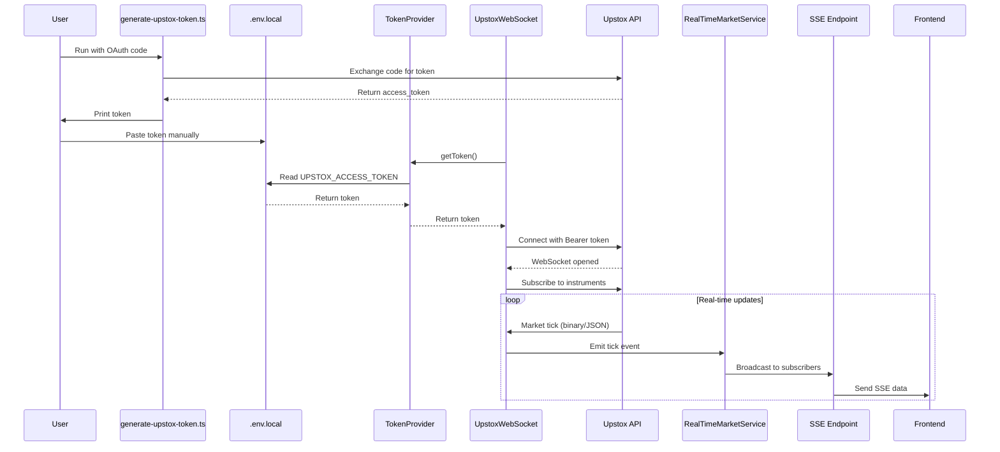
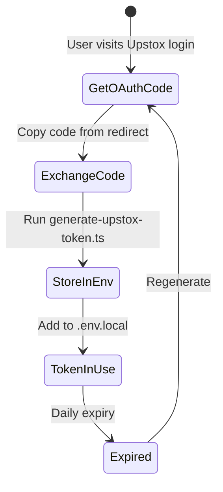
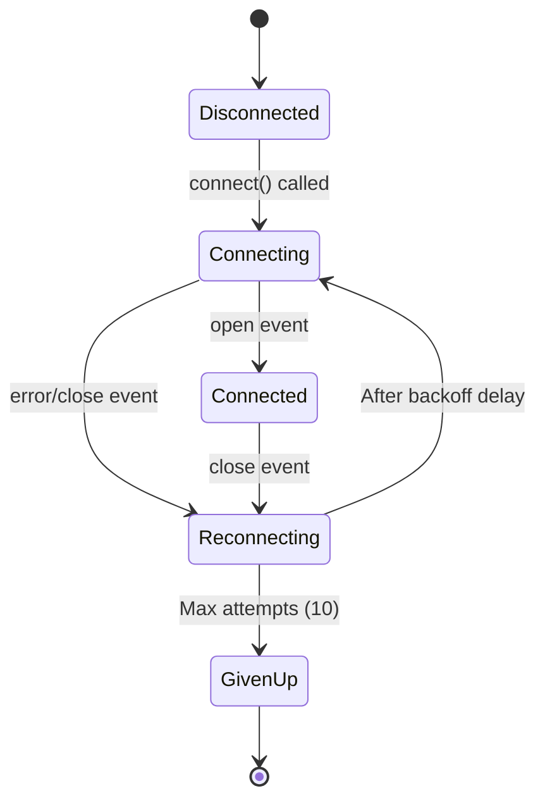

# Upstox Integration Process

**Project**: Paper Market Pro  
**Integration Type**: Real-time Market Data via WebSocket  
**Provider**: Upstox API v2

---

## 📋 Table of Contents

1. [Overview](#overview)
2. [Architecture](#architecture)
3. [Implementation Phases](#implementation-phases)
4. [Technical Details](#technical-details)
5. [Testing Workflow](#testing-workflow)
6. [Deployment Guide](#deployment-guide)

---

## Overview

### Goal

Replace simulated market data with real-time market feeds from Upstox, enabling Paper Market Pro to display live Indian market prices.

### Scope

- **In Scope**: Real-time quotes, WebSocket feed, token management
- **Out of Scope**: Order execution (paper trading only), historical data backfill

### Success Criteria

1. ✅ WebSocket connects successfully with real Upstox token
2. ⏳ SSE endpoint streams real-time price updates
3. ⏳ Frontend receives live ticks without errors

---

## Architecture

### High-Level Flow



### Layer Responsibilities

| Layer          | File                                        | Responsibility                  |
| -------------- | ------------------------------------------- | ------------------------------- |
| **Script**     | `scripts/generate-upstox-token.ts`          | One-time token generation       |
| **Config**     | `lib/config.ts`                             | Environment variable validation |
| **Provider**   | `lib/integrations/upstox/token-provider.ts` | Token abstraction               |
| **Transport**  | `lib/integrations/upstox/websocket.ts`      | WebSocket connection            |
| **Service**    | `services/realtime-market.service.ts`       | Price cache & events            |
| **Controller** | `app/api/v1/market/stream/route.ts`         | SSE HTTP handler                |

---

## Implementation Phases

### Phase 1: Token Generator Script ✅

**Problem**: No way to obtain Upstox access token in dev environment.

**Solution**: Create CLI script to exchange OAuth code for token.

**Files Created**:

- `scripts/generate-upstox-token.ts`

**Key Features**:

- Zod validation of CLI arguments
- Masked token logging (only shows last 6 chars)
- Clear error messages for network/auth failures
- Outputs token for manual copy to `.env`

**Testing**:

```bash
npx tsx scripts/generate-upstox-token.ts <CODE>
```

**Expected Output**:

```
INFO: Exchanging Upstox authorization code...
INFO: Token received: ***A9xTQ2

✅ SUCCESS: Token obtained!

Add this to your .env.local file:
──────────────────────────────────────────────────
UPSTOX_ACCESS_TOKEN=eyJhbGciOiJIUzI1NiIs...
──────────────────────────────────────────────────
```

---

### Phase 2: Token Provider Abstraction ✅

**Problem**: WebSocket needs token, but shouldn't read `process.env` directly.

**Solution**: Create `UpstoxTokenProvider` class with clean interface.

**Files Created**:

- `lib/integrations/upstox/token-provider.ts`
- `scripts/test-token.ts` (verification)

**Design Decisions**:

- Single responsibility: Only returns token
- Throws `ApiError` if token missing (not silent failure)
- Future-proof: Can switch from ENV to DB without changing consumers
- Singleton exported for convenience

**API**:

```typescript
class UpstoxTokenProvider {
  async getToken(): Promise<string>; // Throws if missing
  hasToken(): boolean; // Non-throwing check
}
```

**Testing**:

```bash
npx tsx scripts/test-token.ts
```

**Expected Output**:

```
✅ SUCCESS: Token loaded
   Preview: eyJhbGciO...A9xTQ2
   Length: 512 characters
```

---

### Phase 3: WebSocket Client Integration ✅

**Problem**: Existing `websocket.ts` used hardcoded `"Bearer mock_token"`.

**Solution**: Refactor to use `TokenProvider` + add production-grade reconnection.

**Files Modified**:

- `lib/integrations/upstox/websocket.ts`

**Files Created**:

- `scripts/test-upstox-ws.ts`

**Key Improvements**:

#### 1. Real Token Auth

```typescript
// Before
this.ws = new WebSocket(url, {
  headers: { Authorization: "Bearer mock_token" },
});

// After
const token = await this.tokenProvider.getToken();
this.ws = new WebSocket(url, {
  headers: { Authorization: `Bearer ${token}` },
});
```

#### 2. Exponential Backoff

```typescript
const delay = Math.min(
  BASE_RECONNECT_DELAY_MS * Math.pow(2, this.reconnectAttempts) +
    Math.random() * 1000,
  MAX_RECONNECT_DELAY_MS,
);
```

Schedule:

- Attempt 1: ~1s
- Attempt 2: ~2s
- Attempt 3: ~4s
- ...
- Attempt 10: 30s (max, then give up)

#### 3. Connection State Management

```typescript
if (this.isConnecting) {
  logger.debug("Connection already in progress");
  return;
}
```

Prevents race conditions from multiple `connect()` calls.

**Testing**:

```bash
npx tsx scripts/test-upstox-ws.ts
```

**Expected Output**:

```
Testing Upstox WebSocket connection...

INFO: Connecting to Upstox WebSocket...
INFO: Upstox WebSocket connected
INFO: Subscribed to instruments

✅ WebSocket connected!

Subscribing to: NSE_INDEX|Nifty 50, NSE_INDEX|Nifty Bank

Listening for 30 seconds...

Tick 1: {"feeds":{"NSE_INDEX|Nifty 50":{"ff":{"marketFF":{"ltp":22132.4}}}}}
Tick 2: {"feeds":{"NSE_INDEX|Nifty 50":{"ff":{"marketFF":{"ltp":22132.6}}}}}
...
```

---

### Phase 4: RealTimeMarketService Integration ✅

**Problem**: Service needs to use real data instead of simulation.

**Solution**: **No changes required!** Service already uses `UpstoxWebSocket`.

**Why It Works**:

```typescript
// realtime-market.service.ts (unchanged)
import { UpstoxWebSocket } from "@/lib/integrations/upstox/websocket";

class RealTimeMarketService extends EventEmitter {
  private ws: UpstoxWebSocket;

  async initialize() {
    await this.ws.connect(this.handleMarketUpdate.bind(this));
  }
}
```

Since we upgraded `UpstoxWebSocket` in Phase 3, this service automatically gets real data.

**Verification**:
No code changes = no new bugs. Service maintains same API:

- `getQuote(symbol)` → Returns cached price
- `getAllQuotes()` → Returns all prices
- Emits `tick` events → For SSE

---

### Phase 5: SSE Stream Verification ⏳

**Problem**: Frontend needs real-time updates.

**Solution**: Existing SSE endpoint already wired correctly.

**Endpoint**: `GET /api/v1/market/stream?symbols=<COMMA_SEPARATED>`

**Implementation** (already exists in `app/api/v1/market/stream/route.ts`):

```typescript
export async function GET(req: NextRequest) {
  const symbols = searchParams.get("symbols")?.split(",") || [];

  await realTimeMarketService.initialize();
  realTimeMarketService.subscribe(symbols);

  const stream = new ReadableStream({
    start(controller) {
      const onTick = (quote) => {
        controller.enqueue(
          encoder.encode(`data: ${JSON.stringify(quote)}\\n\\n`),
        );
      };
      realTimeMarketService.on("tick", onTick);
    },
  });

  return new NextResponse(stream, {
    headers: { "Content-Type": "text/event-stream" },
  });
}
```

**Testing**:

```bash
# Terminal 1
npm run dev

# Terminal 2 or Browser
curl http://localhost:3000/api/v1/market/stream?symbols=NSE_INDEX|Nifty%2050
```

**Expected Output** (SSE format):

```
data: {"type":"connected"}

data: {"type":"tick","data":{"symbol":"NSE_INDEX|Nifty 50","price":22132.4,"lastUpdated":"2026-01-26T19:00:00.000Z"}}

data: {"type":"tick","data":{"symbol":"NSE_INDEX|Nifty 50","price":22132.6,"lastUpdated":"2026-01-26T19:00:01.500Z"}}

: keep-alive
```

---

## Technical Details

### Token Lifecycle



### WebSocket Reconnection Logic



### Symbol Format Mapping

| Internal Symbol | Upstox Instrument Key      | Type   |
| --------------- | -------------------------- | ------ |
| `NIFTY`         | `NSE_INDEX\|Nifty 50`      | Index  |
| `BANKNIFTY`     | `NSE_INDEX\|Nifty Bank`    | Index  |
| `RELIANCE`      | `NSE_EQ\|RELIANCE`         | Equity |
| `NIFTY25000CE`  | `NSE_FO\|NIFTY26JAN2600CE` | Option |

**Note**: Symbol mapper not yet implemented. Use Upstox format directly for now.

---

## Testing Workflow

### 1. Unit Test: Token Provider

```bash
npx tsx scripts/test-token.ts
```

Verifies:

- ✅ Token reads from env
- ✅ Error thrown if missing
- ✅ Token format is valid

---

### 2. Integration Test: WebSocket

```bash
npx tsx scripts/test-upstox-ws.ts
```

Verifies:

- ✅ Connection established
- ✅ Subscription sent
- ✅ Ticks received
- ✅ Graceful disconnect

---

### 3. End-to-End Test: SSE Stream

**Setup**:

```bash
npm run dev
```

**Test**:

```bash
curl -N http://localhost:3000/api/v1/market/stream?symbols=NSE_INDEX|Nifty%2050
```

Verifies:

- ✅ SSE connection opens
- ✅ Real-time ticks streamed
- ✅ Keep-alive heartbeats sent

---

### 4. Frontend Test: Manual Verification

Open browser DevTools → Network → EventStream:

```javascript
const es = new EventSource(
  "/api/v1/market/stream?symbols=NSE_INDEX|Nifty%2050",
);
es.onmessage = (e) => console.log(JSON.parse(e.data));
```

Verifies:

- ✅ Browser receives SSE events
- ✅ No CORS errors
- ✅ Connection stays alive

---

## Deployment Guide

### Development Setup

1. **Install dependencies** (if not already):

   ```bash
   npm install ws zod pino
   ```

2. **Configure `.env.local`**:

   ```env
   UPSTOX_API_KEY=33bdc12c-d51e-454e-8e3c-7aad31946e67
   UPSTOX_API_SECRET=t56mmerudu
   UPSTOX_REDIRECT_URI=http://localhost:3000/api/integrations/upstox/callback
   UPSTOX_ACCESS_TOKEN=<run generate-upstox-token.ts to get this>
   ```

3. **Generate token**:

   ```bash
   npx tsx scripts/generate-upstox-token.ts <OAUTH_CODE>
   ```

4. **Start dev server**:
   ```bash
   npm run dev
   ```

---

### Production Setup

**⚠️ Not Yet Implemented**

For production, replace env-based token with DB-backed OAuth:

1. User logs in with Upstox OAuth
2. Token stored in `upstoxTokens` table (per user)
3. `UpstoxTokenProvider.getToken()` reads from DB instead of env
4. Auto-refresh expired tokens

**Required Changes**:

- [ ] Modify `TokenProvider` to accept `userId` parameter
- [ ] Query `upstoxTokens` table instead of `process.env`
- [ ] Implement token refresh logic
- [ ] Add cron job to clean expired tokens

---

## Compliance with Backend-Dev Rules

All implementation follows `backend-dev/SKILL.md`:

| Rule                      | Implementation                                      |
| ------------------------- | --------------------------------------------------- |
| **No `any` types**        | ✅ All types explicit (Zod inferred types used)     |
| **Zod validation**        | ✅ CLI args validated in `generate-upstox-token.ts` |
| **ApiError for failures** | ✅ `TokenProvider` throws `ApiError`                |
| **Structured logging**    | ✅ All files use `lib/logger.ts`                    |
| **No secret logging**     | ✅ Tokens redacted by logger config                 |
| **Services are pure**     | ✅ No Next.js imports in services                   |
| **Config centralized**    | ✅ All env vars in `lib/config.ts`                  |

---

## Troubleshooting Guide

### Issue: "Failed to initiate WebSocket connection"

**Symptoms**: Error in logs, WebSocket never connects.

**Causes**:

1. Invalid token
2. Token expired
3. Network issue

**Debug Steps**:

```bash
# 1. Verify token exists
npx tsx scripts/test-token.ts

# 2. Check token format (should be JWT)
echo $UPSTOX_ACCESS_TOKEN | cut -d. -f1 | base64 -d

# 3. Test network connectivity
curl https://api.upstox.com/v2/user/profile -H "Authorization: Bearer $UPSTOX_ACCESS_TOKEN"
```

---

### Issue: "No ticks received"

**Symptoms**: WebSocket connects, but no data.

**Causes**:

1. Market is closed
2. Wrong instrument key format
3. Subscription not sent

**Debug Steps**:

```bash
# Enable debug logs
export LOG_LEVEL=debug
npm run dev

# Check logs for:
# - "Subscribed to instruments" (should appear)
# - Instrument keys sent (verify format)
```

---

### Issue: "Token expired daily"

**Symptoms**: Works yesterday, fails today.

**Expected Behavior**: Upstox tokens expire at end-of-day.

**Solution**:

```bash
# Re-run token generation daily
npx tsx scripts/generate-upstox-token.ts <NEW_CODE>
```

**Production Solution** (not yet implemented): Auto-refresh tokens from DB.

---

## Future Roadmap

### Short-term (Next Sprint)

- [ ] Add symbol mapper service
- [ ] Implement token auto-refresh
- [ ] Add WebSocket health metrics

### Medium-term

- [ ] Multi-user token management (DB-backed)
- [ ] Historical data backfill
- [ ] TrueData integration for option chains

### Long-term

- [ ] Order execution via Upstox API
- [ ] Portfolio syncing (paper ↔ live)
- [ ] Alerts & notifications

---

## References

- **Upstox API Docs**: [https://upstox.com/developer/api-documentation](https://upstox.com/developer/api-documentation)
- **Backend-Dev Rules**: `backend-dev/SKILL.md`
- **Implementation Plan**: `.gemini/antigravity/brain/4f1c9505-459f-4048-b9e3-122ae940f602/implementation_plan.md`
